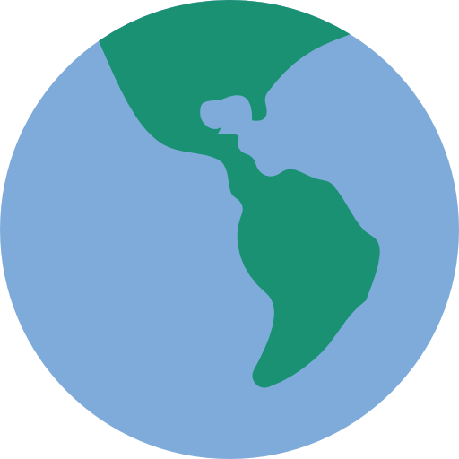
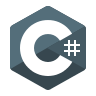
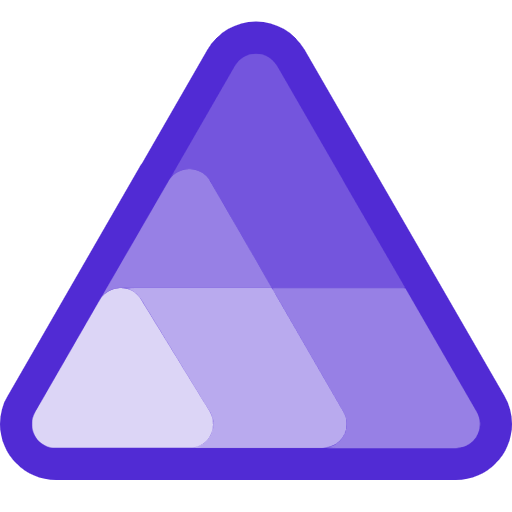
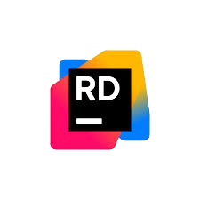
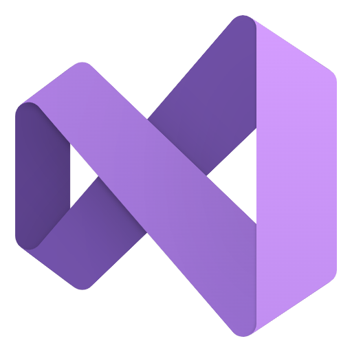

<h1 align="center">Hallo liebe Welt! 🚀</h1>

Hey! Mein Spitzname ist Nicki. Hier sind ein paar Skills von mir.

<h1 align="center">Kontakt 📬</h1>

  

    
    
    
    <!---->
    <!---->
    
  

<h1 align="center">Technologien & Sprachen 📜</h1>

  

    
    
    
    
    
    
    
    
    
    
    
    
    
    
    
    
  

  <h1 align="center">Programme, die ich benutze 💖</h1>

  

    
    <!--  -->
     
    
    
    
  

<h1 align="center">Meine Profil Statistiken 📊</h1>

  
   
  
   
  
  <!---->
   
  

<!--<h1 align="center">GitHub Profil Trophäen 🏆</h1>

  

-->

